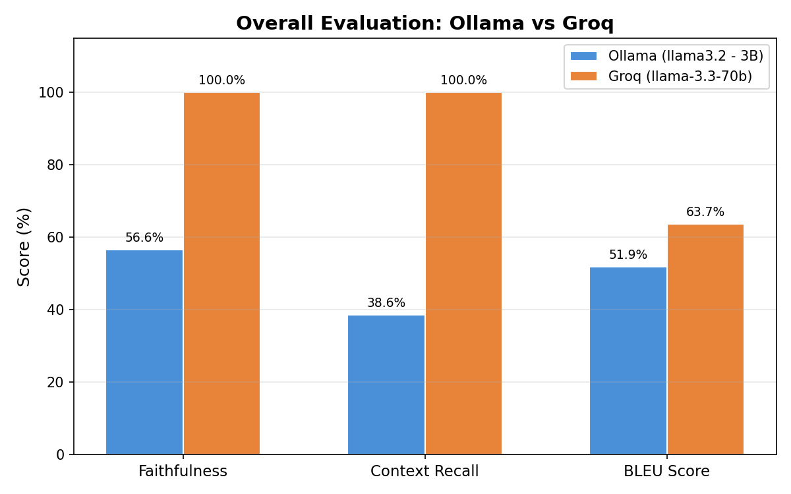
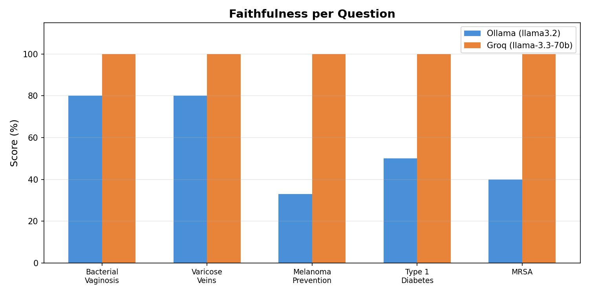
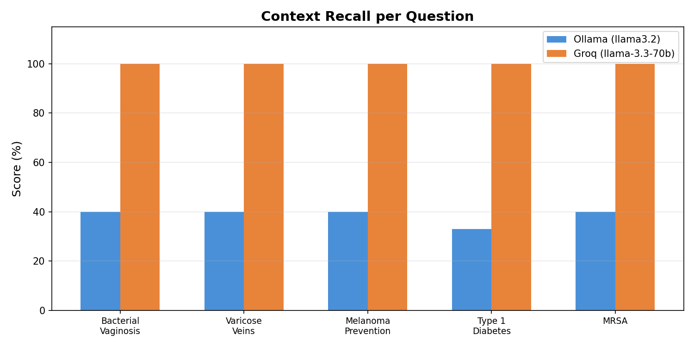
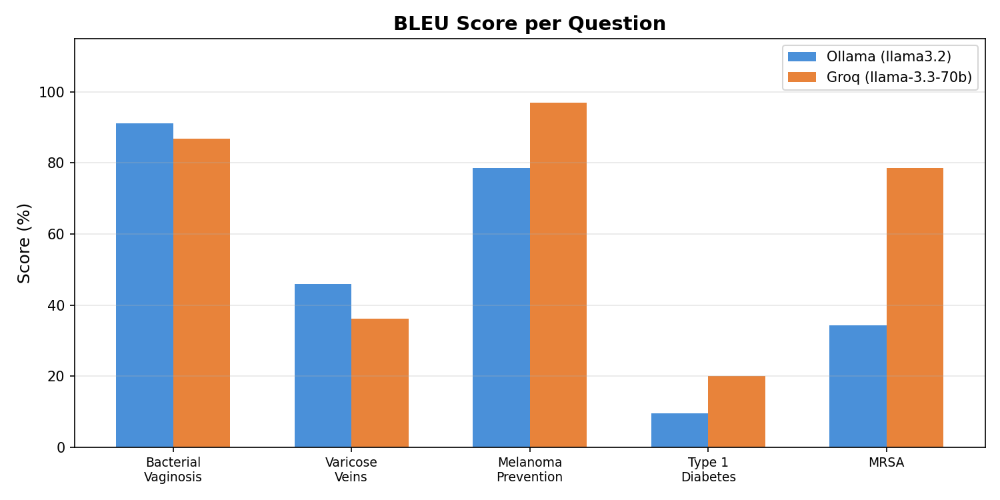

# RAG Evaluation Comparison Report

## Ollama (llama3.2 - 3B, Local) vs Groq (llama-3.3-70b, API)

---

## 1. Overview

This report compares the evaluation results of the same RAG (Retrieval-Augmented Generation) pipeline using two different LLM backends:

| | Ollama | Groq |
|---|---|---|
| Model | llama3.2 (3B params) | llama-3.3-70b-versatile (70B params) |
| Hosting | Local (on-device) | Cloud API (free tier) |
| Used for | RAG generation + LLM-as-judge evaluation | RAG generation + LLM-as-judge evaluation |
| Questions evaluated | 5 | 5 |

Both runs used the same retrieval pipeline (ChromaDB + sentence-transformers + cross-encoder reranker), same questions, and same reference documents.

---

## 2. Overall Results

| Metric | Ollama (llama3.2) | Groq (llama-3.3-70b) | Difference |
|---|---|---|---|
| Faithfulness | 56.6% | 100.0% | +43.4% |
| Context Recall | 38.6% | 100.0% | +61.4% |
| BLEU Score | 51.9% | 63.7% | +11.8% |

---

## 3. Per-Question Breakdown

### 3.1 Faithfulness

Faithfulness measures whether the generated answer only contains information supported by the retrieved context.

| Question | Ollama | Groq |
|---|---|---|
| What are the symptoms of bacterial vaginosis? | 80.0% | 100.0% |
| What causes varicose veins? | 80.0% | 100.0% |
| How can skin cancer (melanoma) be prevented? | 33.0% | 100.0% |
| What is it like to live with type 1 diabetes? | 50.0% | 100.0% |
| What should I know about MRSA? | 40.0% | 100.0% |

### 3.2 Context Recall

Context recall measures how well the retrieved context covers the information in the ground-truth reference answer.

| Question | Ollama | Groq |
|---|---|---|
| What are the symptoms of bacterial vaginosis? | 40.0% | 100.0% |
| What causes varicose veins? | 40.0% | 100.0% |
| How can skin cancer (melanoma) be prevented? | 40.0% | 100.0% |
| What is it like to live with type 1 diabetes? | 33.0% | 100.0% |
| What should I know about MRSA? | 40.0% | 100.0% |

### 3.3 BLEU Score

BLEU is a purely algorithmic metric (no LLM involved) that measures word overlap between the generated answer and the reference answer.

| Question | Ollama | Groq |
|---|---|---|
| What are the symptoms of bacterial vaginosis? | 91.1% | 86.8% |
| What causes varicose veins? | 45.9% | 36.1% |
| How can skin cancer (melanoma) be prevented? | 78.5% | 96.9% |
| What is it like to live with type 1 diabetes? | 9.6% | 20.0% |
| What should I know about MRSA? | 34.2% | 78.6% |

---

## 4. Analysis: Why Such a Big Difference?

### 4.1 Judge Model Quality (Main Factor)

Faithfulness and context recall are scored by the LLM acting as a judge. The 3B model (llama3.2) is a weak evaluator — it inconsistently assesses whether responses are grounded in context, often giving lower scores even when the answer is clearly faithful. The 70B model (llama-3.3-70b) understands the evaluation task much better and scores more accurately.

This is the primary reason for the large gap in faithfulness (56.6% → 100%) and context recall (38.6% → 100%).

### 4.2 Generation Quality (Secondary Factor)

The 70B model also generates slightly better RAG answers. For example:
- Melanoma: Groq included "Melanoma is not always preventable, but..." (matching the reference closely), while Ollama said "Melanoma can be prevented by..." (a subtle inaccuracy).
- MRSA: Groq's answer was more concise and closer to the source material.

### 4.3 BLEU Tells the Real Story

Since BLEU is computed algorithmically with no LLM bias, it shows the actual answer quality difference more honestly. The improvement is moderate (51.9% → 63.7%), confirming that the answer quality improved but not as dramatically as the LLM-judged metrics suggest.

### 4.4 Type 1 Diabetes — Low for Both

Both models scored low on BLEU for this question because the reference answer is extremely short ("Advice on avoiding complications of type 1 diabetes") — there simply isn't enough ground-truth content for either model to match against.

---

## 5. Key Takeaways

1. Using a small model (3B) as both generator and judge produces unreliable evaluation scores.
2. The 70B model via Groq API provides significantly better generation and more reliable evaluation.
3. BLEU scores are the most objective metric in this comparison since they don't depend on LLM judgment.
4. For fair comparison, the same judge model should evaluate both sets of answers (e.g., use Groq's 70B to judge Ollama's answers too).

---

## 6. Files Reference

| File | Description |
|---|---|
| `evaluation.py` | Evaluation script using Ollama (llama3.2) |
| `evaluation_groq.py` | Evaluation script using Groq API (llama-3.3-70b) |
| `ragas_results.csv` | Ollama evaluation results |
| `ragas_results_groq.csv` | Groq evaluation results |
| `ragas_details.json` | Ollama detailed results with contexts |
| `ragas_details_groq.json` | Groq detailed results with contexts |
| `chart_overall_comparison.png` | Overall comparison bar chart |
| `chart_faithfulness_per_question.png` | Per-question faithfulness chart |
| `chart_context_recall_per_question.png` | Per-question context recall chart |
| `chart_bleu_per_question.png` | Per-question BLEU chart |
